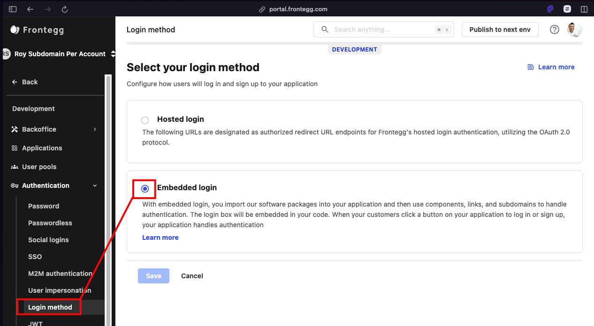
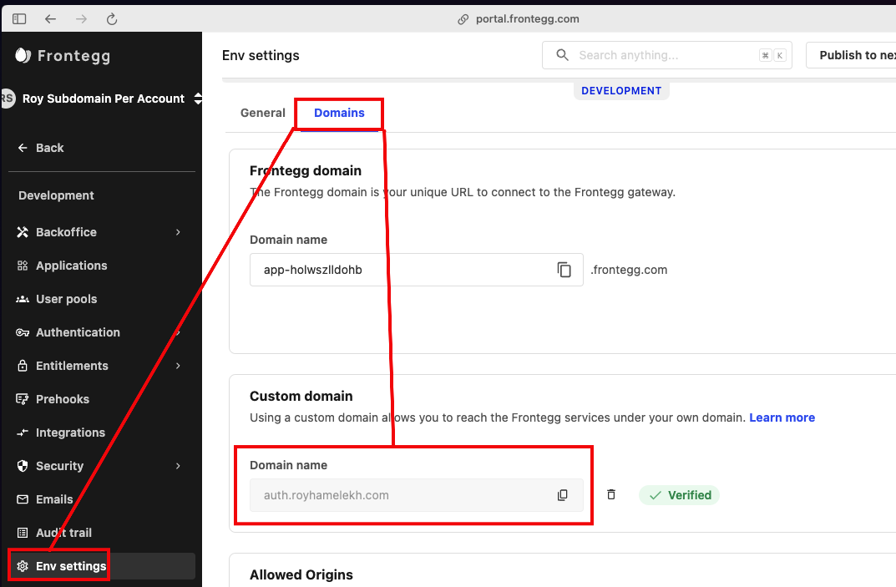
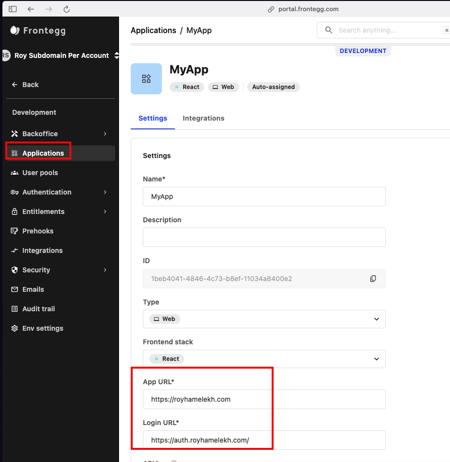
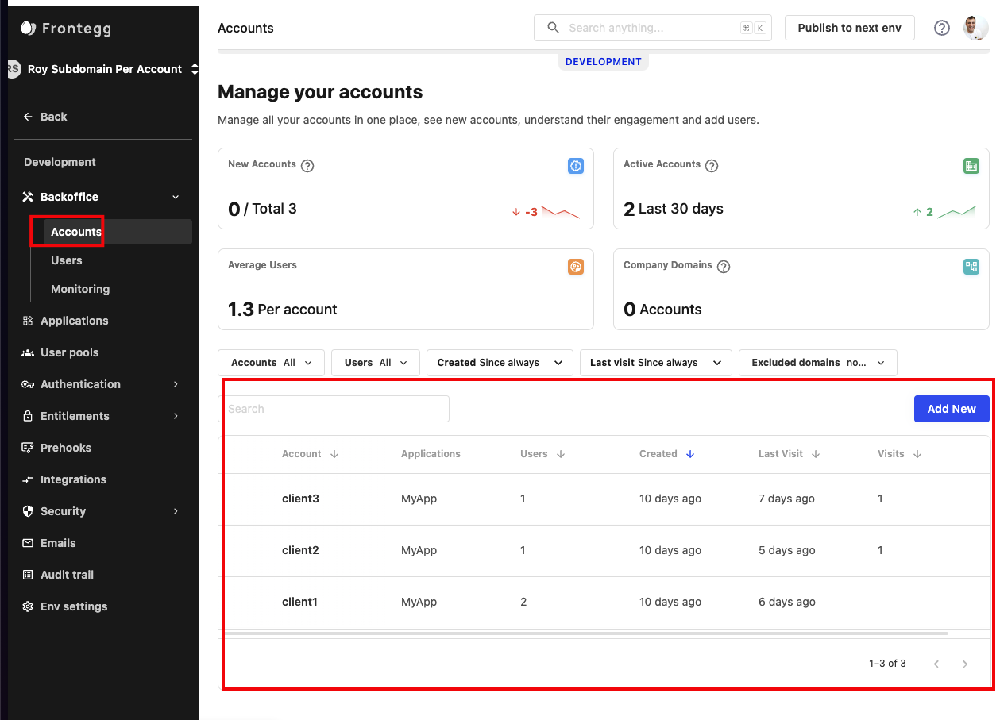
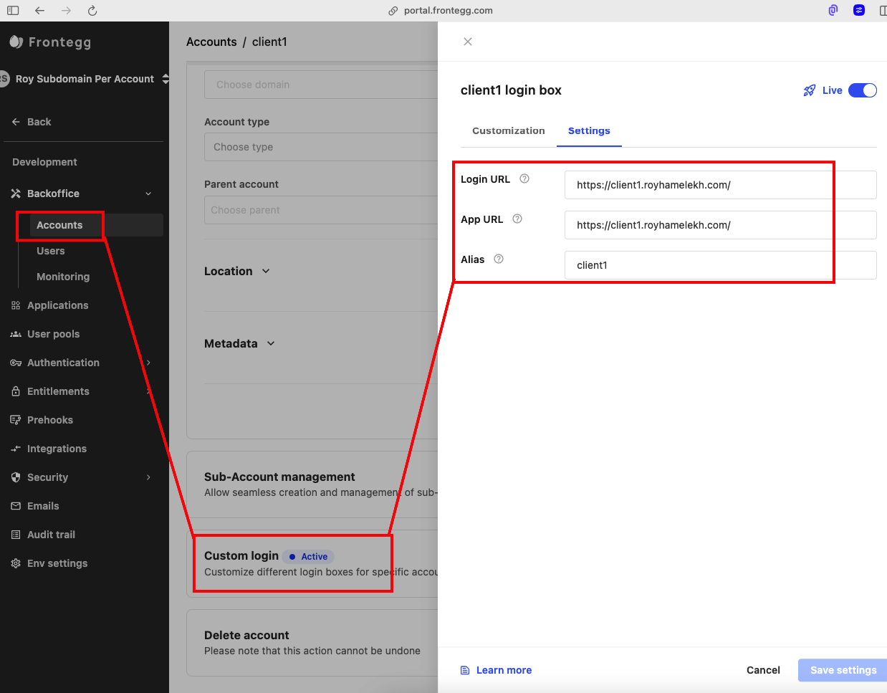

# Frontegg - Subdomain per Tenant

This repository demonstrates how to set up a dedicated subdomain for each of your clients using Frontegg. For example, our parent domain can be `royhamelekh.com` and then we can add three different tenants\accounts in Frontegg, each with its own dedicated subdomain:

- The first client 'Client1' will be accessible from - [https://client1.royhamelekh.com/](https://client1.royhamelekh.com/)
- 'Client2' will be accessible from [https://client2.royhamelekh.com/](https://client2.royhamelekh.com/)
- And 'Client3' will be accessible from [https://client3.royhamelekh.com/](https://client3.royhamelekh.com/)
(You can add as many accounts\tenants as you'd like in the future)

We use [Embedded login with Frontegg](https://docs.frontegg.com/docs/react-embedded-login-guide) and the [Customization per tenant feature](https://docs.frontegg.com/docs/custom-login-box).

## Part 1: Frontegg Account Setup

1. **Enable Embedded Login Mode:**
   - Navigate to `Frontegg Portal ➜ [ENVIRONMENT] ➜ Authentication ➜ Login Method`.
   - Select `Embedded login` mode.
   - 

2. **Set Up a Custom Domain:**
   - Follow the instructions [here](https://docs.frontegg.com/docs/custom-domains).
   - 

3. **Update Application URLs:**
   - Open your application settings and change the Login URL and App URL to use the custom domain.
   - 

4. **Create Dedicated Accounts for Each Client:**
   - Go to `Backoffice ➜ Accounts` and create an account for each client.
   - 

5. **Enable Customization per Tenant:**
   - Enable the [Customization per tenant feature](https://docs.frontegg.com/docs/custom-login-box) for each account.
   - Navigate to `Frontegg Portal ➜ [ENVIRONMENT] ➜ Backoffice ➜ Accounts ➜ [CLIENT_ACCOUNT] ➜ Settings ➜ Custom login` to tie the subdomain to the account.
   - 


### Part 2: Running this code
Clone this repo.
Open `src\index.js` and add the values from your environment:
`baseUrl`: Login URL from `Frontegg Portal ➜ [ENVIRONMENT] ➜ Applications`:
`appId`: Application ID from `Frontegg Portal ➜ [ENVIRONMENT] ➜ Applications`:
`clientId`: Client ID and API Key from `Frontegg Portal ➜ [ENVIRONMENT] ➜ Env Settings page`.
```
const contextOptions = {
  baseUrl: 'https://[YOUR_DOMAIN].com',
  clientId: '[YOUR-CLIENT-ID]',
  appId: '[YOUR-APP-ID]'
};
```

